## [Learning Generative Structure Prior for Blind Text Image Super-resolution](https://arxiv.org/pdf/2303.14726.pdf)

[Xiaoming Li](https://csxmli2016.github.io/), [Wangmeng Zuo](https://scholar.google.com/citations?hl=en&user=rUOpCEYAAAAJ&view_op=list_works), [Chen Change Loy](https://www.mmlab-ntu.com/person/ccloy/)

S-Lab, Nanyang Technological University


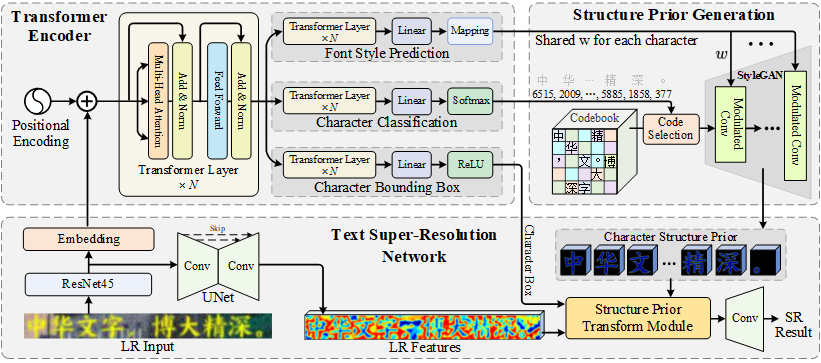

<p align="justify">Blind text image super-resolution (SR) is challenging as one needs to cope with diverse font styles and unknown degradation. To address the problem, existing methods perform character recognition in parallel to regularize the SR task, either through a loss constraint or intermediate feature condition. Nonetheless, the high-level prior could still fail when encountering severe degradation. The problem is further compounded given characters of complex structures, e.g., Chinese characters that combine multiple pictographic or ideographic symbols into a single character. In this work, we present a novel prior that focuses more on the character structure. In particular, we learn to encapsulate rich and diverse structures in a StyleGAN and exploit such generative structure priors for restoration. To restrict the generative space of StyleGAN so that it obeys the structure of characters yet remains flexible in handling different font styles, we store the discrete features for each character in a codebook. The code subsequently drives the StyleGAN to generate high-resolution structural details to aid text SR. Compared to priors based on character recognition, the proposed structure prior exerts stronger character-specific guidance to restore faithful and precise strokes of a designated character. Extensive experiments on synthetic and real datasets demonstrate the compelling performance of the proposed generative structure prior in facilitating robust text SR. </p>

## TODO
- [x] Release the inference code and model in April.
- [x] Release the training code.
- [ ] Release a model focusing on English letters and numbers.
- [x] [We provide a simple blind text region super-resolution framework](https://github.com/csxmli2016/textbsr) by ```pip install textbsr```

## Getting Start

```
git clone https://github.com/csxmli2016/MARCONet
cd MARCONet
conda create -n marconet python=3.8 -y
conda activate marconet
pip install -r requirements.txt
BASICSR_EXT=True pip install basicsr
```
> Please carefully follow the installation steps, especially the final one with **BASICSR_EXT=True**. 

## Pre-trained Models
Download the pre-trained models
```
python checkpoints/download_github.py
```

## Inference for SR
```
CUDA_VISIBLE_DEVICES=0 python test_sr.py 
```
```
# Parameters:
-i: LR path, default: ./Testsets/LQs
-o: save path, default: None will automatically make the saving dir with the format of '[LR path]_TIME_MARCONet'
```

### Some restoration results on real-world LR text segments (From top to bottom: LR input, bounding box, SR result, and structure prior image)
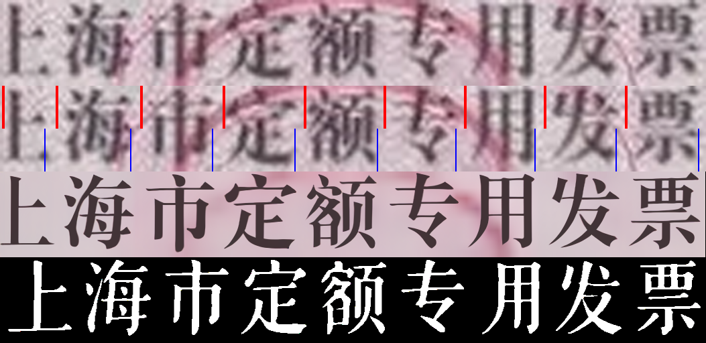&nbsp;&nbsp;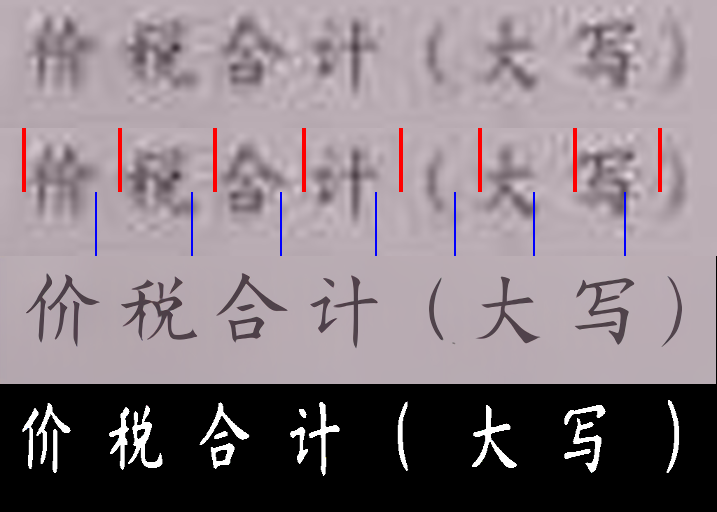

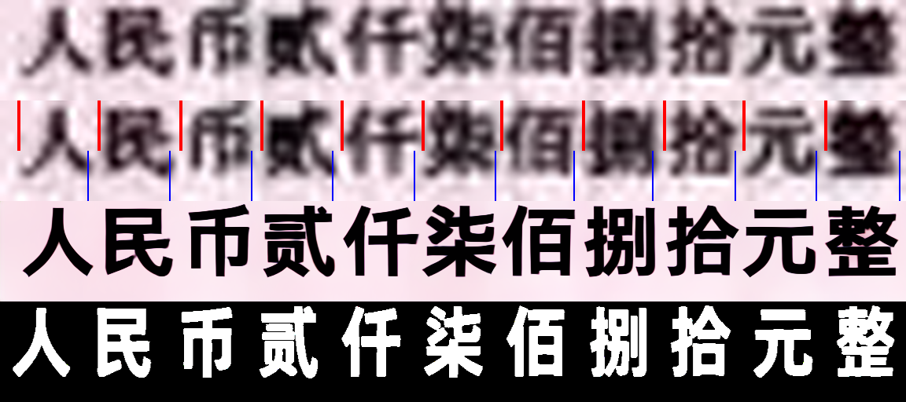&nbsp;&nbsp;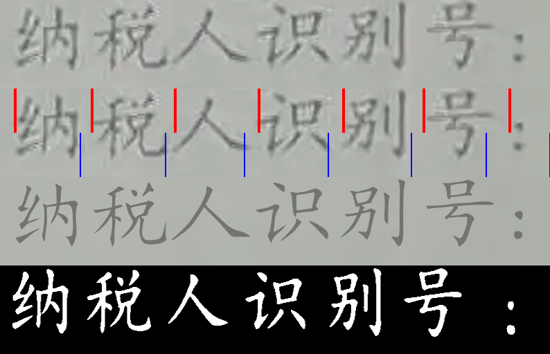


### More real-world LR Chinese Text Image Super-resolution


### Manually correct the text recognition results
Since some characters easily have the wrong predictions when the degradation is severe, here we can manually provide the text labels.

For example, the following LR input with the text label from the transformer encoder:

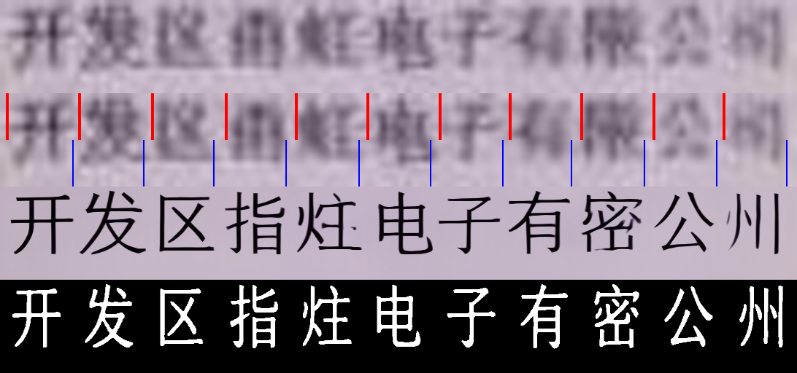

By manually providing the text labels on the image name (format: '*_开发区雨虹电子有限公司.png'):

```
CUDA_VISIBLE_DEVICES=0 python test_sr.py -i ./Testsets/LQsWithText -m
```
```
# Parameters:
-i: LR path, default: ./Testsets/LQsWithText
-o: save path, default: None will automatically make the saving path with the format of '[LR path]_TIME_MARCONet'
-m: default: store_true, using text label from the LR image name
```

Then the SR results will be:

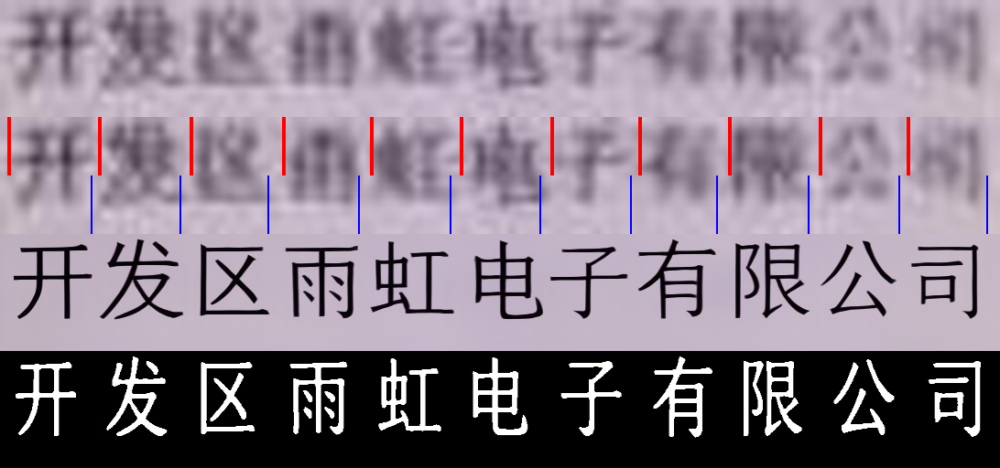


## Inference for controlling the font style with w
```
CUDA_VISIBLE_DEVICES=0 python test_w.py
```

```
#Parameters
-w1: image path for extracting the font style w. Default: './Testsets/TestW/w1.png'
-w2: image path for extracting the font style w2. Default: './Testsets/TestW/w2.png'
-o: save path for the interpolation results. Default: './Testsets/TestW'
```

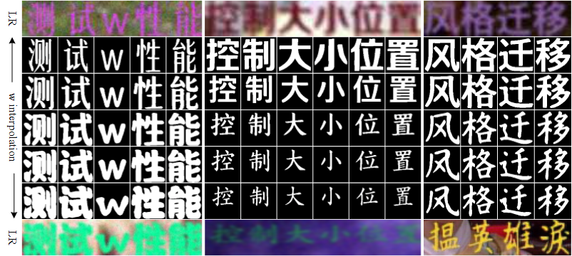

### GIF for interpolating w predicted from two text images with different styles
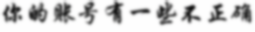

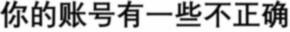

### GIF for interpolating w from two text images with different characters


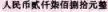

### GIF for interpolating w from two text images with different locations
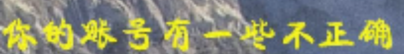

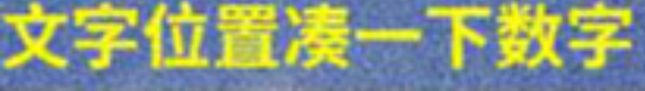


## License
This project is licensed under <a rel="license" href="https://github.com/csxmli2016/MARCONet/blob/main/LICENSE">NTU S-Lab License 1.0</a>. Redistribution and use should follow this license.

## Acknowledgement
This project is built based on the excellent [BasicSR](https://github.com/XPixelGroup/BasicSR) and [KAIR](https://github.com/cszn/KAIR).


## Citation

```
@InProceedings{li2023marconet,
author = {Li, Xiaoming and Zuo, Wangmeng and Loy, Chen Change},
title = {Learning Generative Structure Prior for Blind Text Image Super-resolution},
booktitle = {Proceedings of the IEEE/CVF Conference on Computer Vision and Pattern Recognition},
year = {2023}
}
```


